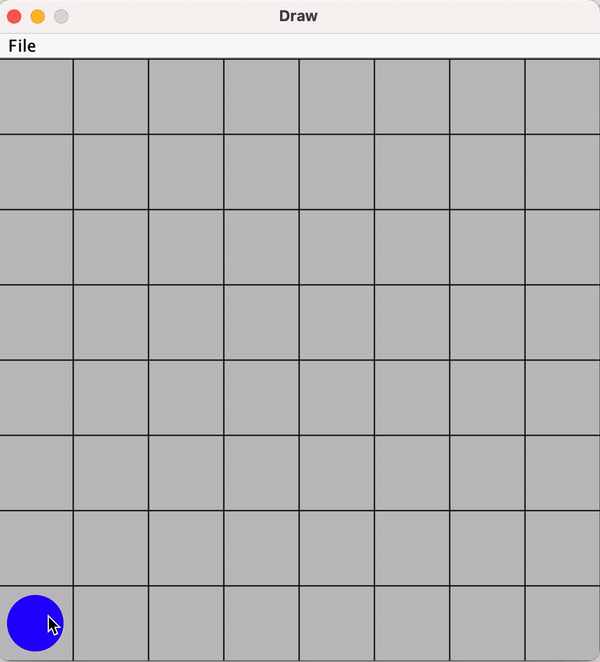

# Desenhando e capturando eventos do mouse com a biblioteca Standard Libraries

Um pequeno exemplo para demonstrar como lidar com o evento de botão do mouse pressionado. Esse exemplo faz uso da [Standard Libraries](https://introcs.cs.princeton.edu/java/stdlib/) da universidade de Princeton, que está sob licença de software livre GPL versão 3.

